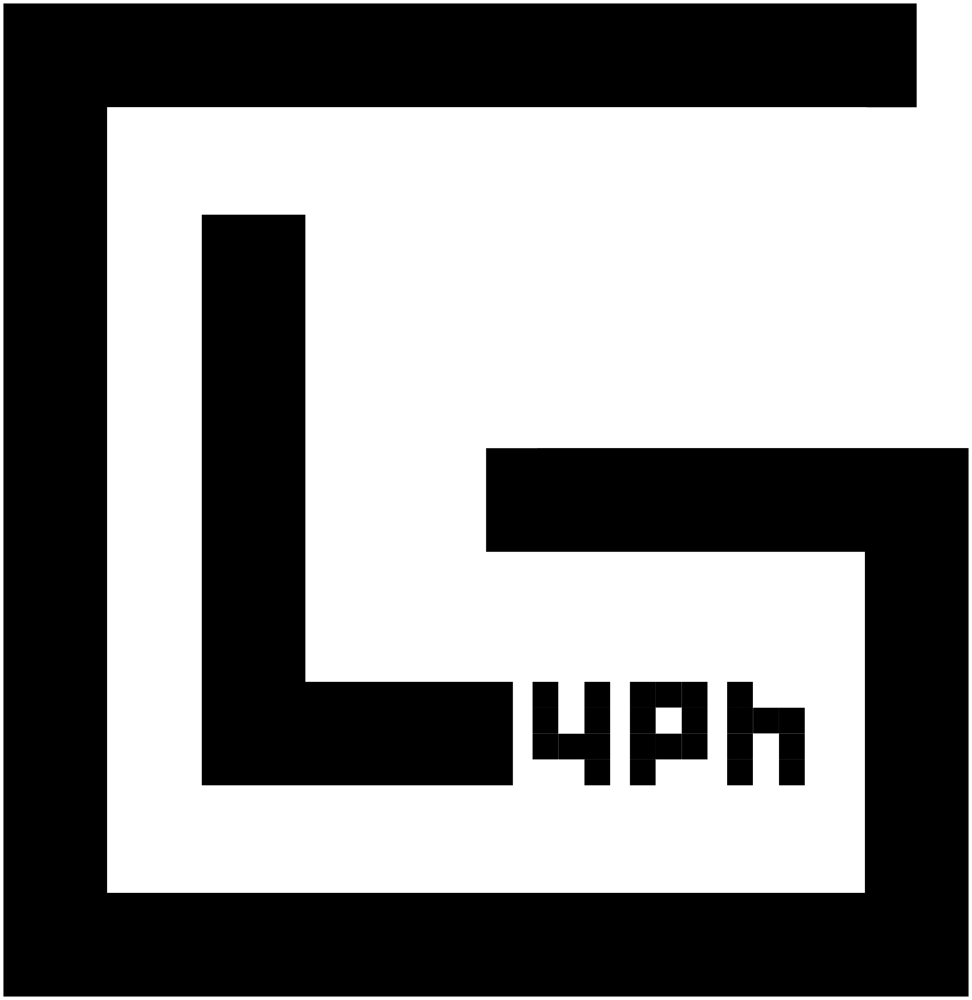

    

# Glyph - Puzzle & Puzzle Hunt Application

Glyph is an application designed to host and manage puzzles and puzzle hunt competitions effectively
and easily.

Glyph exists to help puzzle & puzzle hunt maintainers easily run their events and interact with
participants through a slew of features, some of which are listed below.

* Staged & scheduled releases of certain puzzles and challenges to advance a hunt
* Built-in leaderboards with dynamic points systems to let you design your hunts as desired
* Communication tools such as email & social media integration to provide feedback to hunters

Glyph represents mainly the backend API that powers and stores the data. It aims to be front-end
agnostic, and the community provides a few different options for viable front-ends and integrations.

Please [read the documentation][rtd] for more project information and usage guides.

### Build Status

| **`develop`** |  |  |
|-----------|-----------------------------------------------------------------------------------------------------------------------------|-----------------------------------------------------------------------------------------------------------------------------------|
| **`main`**    |     |     |

## Contributing

Thanks for your interest in contributing! There are many ways to contribute to this project, but
to begin, please read our [contribution guidelines](.github/CONTRIBUTING.md). Due to its infancy,
please reach out via a new GitHub issue so that we may properly onboard you. As the project grows
and matures, we will have a more automated & informal contribution process.

[rtd]: https://glyph-project.readthedocs.io/en/latest/